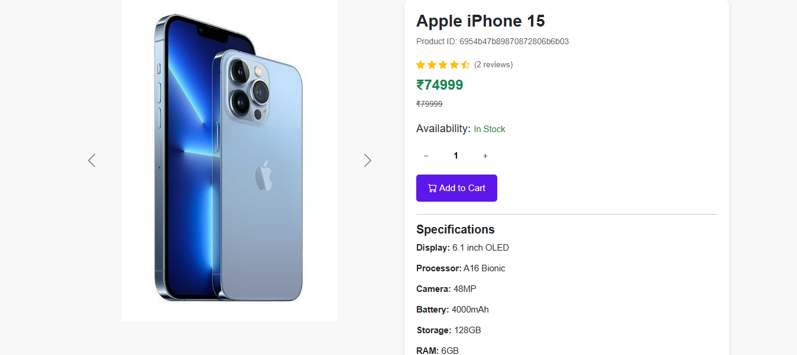
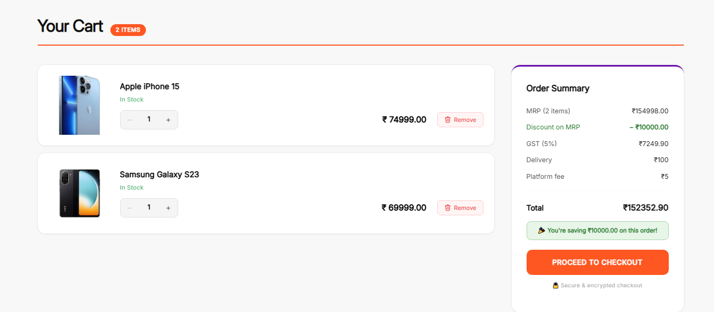
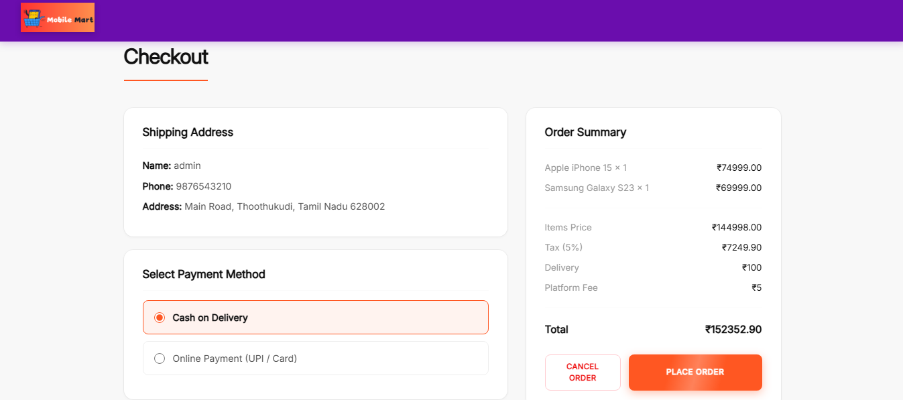
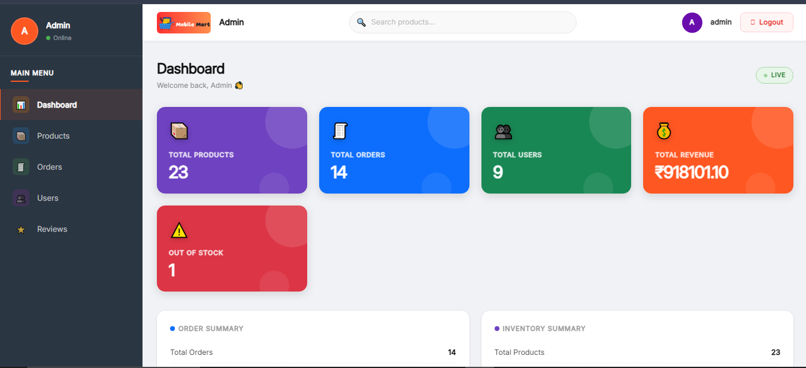
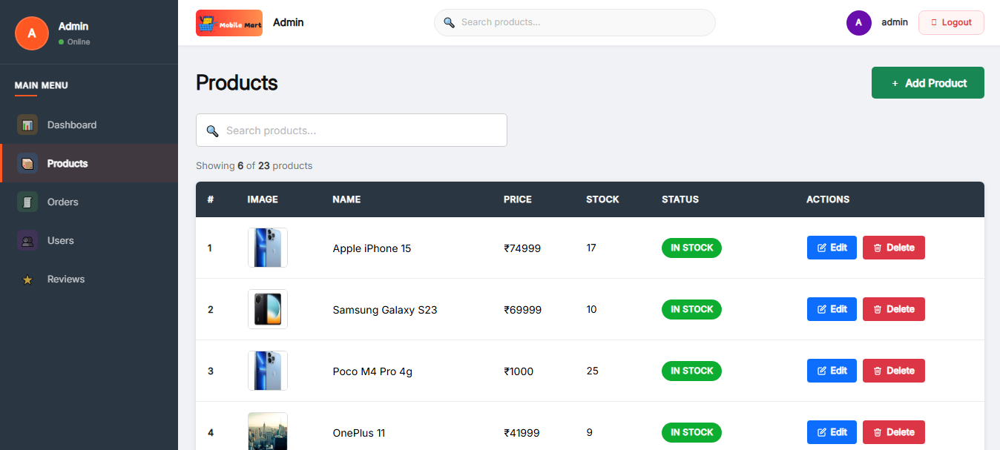
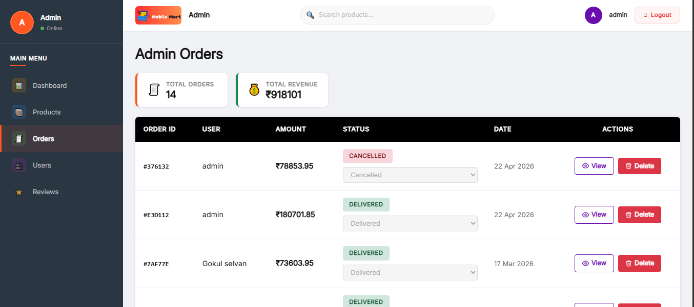
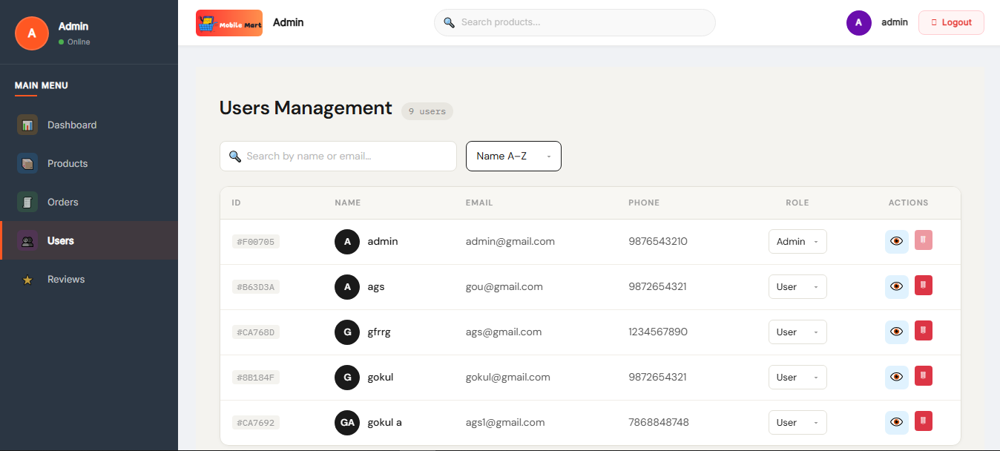

# 📱 Mobile Mart - MERN Stack E-Commerce Platform

Mobile Mart is a full-stack e-commerce web application focused on mobile phone shopping.  
Built using the MERN Stack with secure authentication, admin dashboard, product management, order management, Razorpay payment integration, Cloudinary image uploads, and review moderation.

---

# 🚀 Features

## 👤 User Features
- User Registration & Login
- JWT Authentication
- Protected Routes
- Browse Products
- Product Search & Sorting
- Pagination
- Product Details Page
- Add to Cart
- Checkout System
- Razorpay Payment Gateway
- Order Management
- Product Reviews & Ratings

---

## 🛠 Admin Features
- Admin Dashboard
- Product CRUD Operations
- Multi Image Upload
- Cloudinary Integration
- Orders Management
- Update Order Status
- Users Management
- Update User Roles
- Review Moderation
- Search, Sort & Pagination

---

# 🧰 Tech Stack

## Frontend
- React.js
- Redux Toolkit
- Bootstrap
- React Router DOM
- Axios
- React Toastify

## Backend
- Node.js
- Express.js
- MongoDB
- Mongoose
- JWT Authentication
- Multer
- Cloudinary

## Payment Integration
- Razorpay

---

# 📂 Project Structure

mobile-mart/
│
├── frontend/
├── backend/
├── readme-images/
└── README.md
---

# 📸 Screenshots

## 🏠 Home Page

---

## 📱 Product Details Page

---

## 🛒 Cart Page

---

## 💳 Checkout Page

---

## 📊 Admin Dashboard

---

## 📦 Admin Products Page

---

## 🧾 Admin Orders Page

---

## 👥 Admin Users Page

---

# 🌐 Live Demo

Frontend: Coming Soon  
Backend: Coming Soon

---

# 👨‍💻 Author

### Gokul Selvan

- Portfolio: https://gokul-selvan-dev.netlify.app/
- GitHub: Add Your GitHub Link
- LinkedIn: Add Your LinkedIn Link